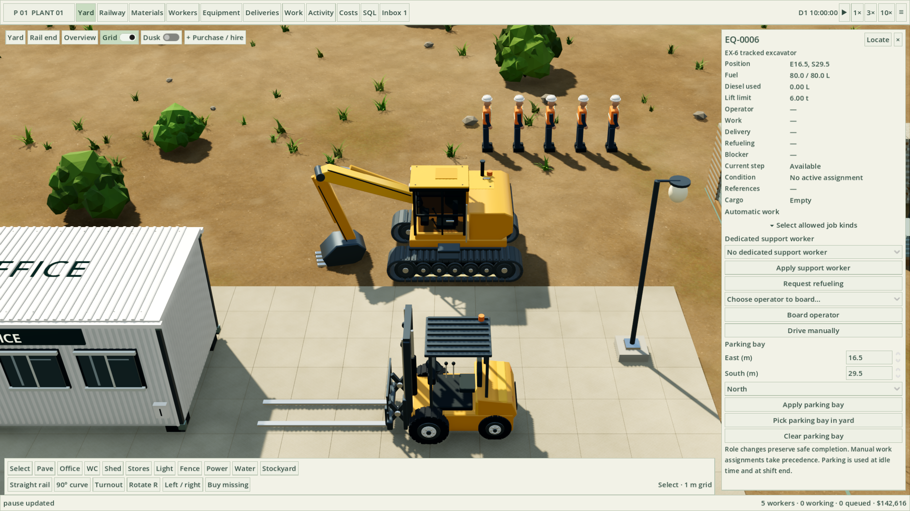
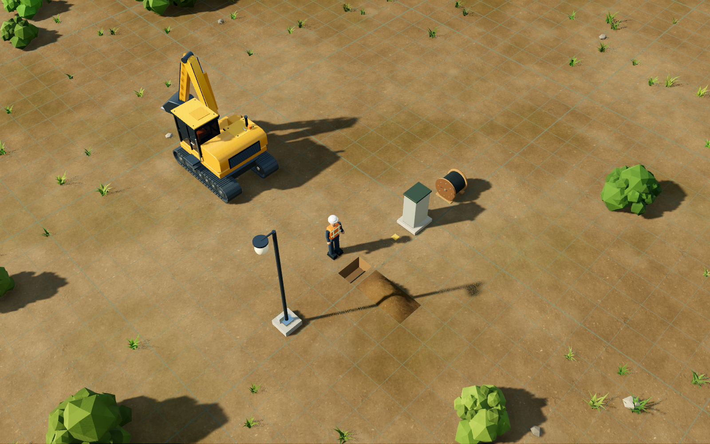
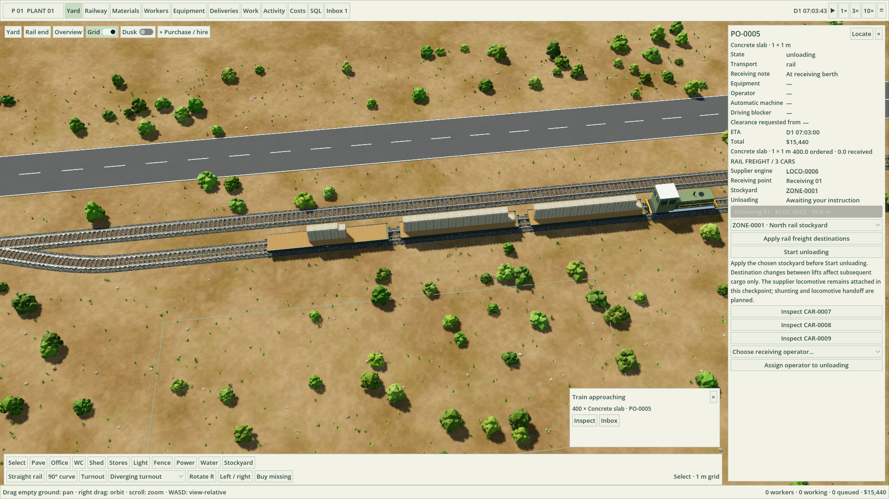

# Plant 01 — Starter Yard

## Native game

The playable Godot migration uses the approved Concept C art and a separate local simulation process. Open **Plant 01.app** in the surrounding `outputs/` folder, or double-click **Open Plant 01.command** for development. No browser is required. [Download the Mac app](https://github.com/lukacslacko/factory_game/releases/tag/v0.28.1). See [native game instructions](native/README.md) and [migration notes](docs/native-migration.md). The browser game and static visual proof remain available below.


A playable first version of the fantasy chemistry plant game. Build and operate the construction yard before chemical production arrives: hire a crew, receive physical materials, move equipment, pave ground, extend track, and assemble a small base.

The world uses a true perspective 3D camera, with a meter grid, dimensional stock, angled lighting, and grid-aligned parked equipment. The records use the approved Condensed direction. The visual target is the latest **80% A / 20% B** selection, rather than the earlier rejected flat world studies.



## Move material to storage — native v0.28.0

Select any physical stock stack and choose **Move to storage…**. Move all or part of its units to an automatically chosen stockyard, or search for a specific yard by name or ID. **Create move work** opens one parent order covering the required capacity-limited lifts; assign its equipment once, or enable automatic **Recovery / relocation**. Owned equipment, an operator, and a ground worker physically handle the material, including in Creative. Partly used drums and reels keep their exact contents; unbuilt kits remain stock. See the [storage move walkthrough](docs/storage-moves.md) for access, reservations, progress, and cancellation.

## Idle equipment clearance — native v0.27.1

Finished equipment work now clears obsolete movement blockers and releases workers who already stepped aside. The same cleanup repairs older saved idle states on the next simulation tick. Active routes, suspended loads, manual control and collision checks remain protected. See [assignment and clearance](docs/worker-assignment-and-clearance.md).

## Electrical construction and selection — native v0.27.0

Electrical work excavates the full run, pulls cable along the open trench, connects both ends, then backfills, restores paving, and tests. The bucket lifts clear before swinging to the spoil pile. Procured junction cabinets create explicit branch points sharing the incoming 16 kW supply. Choose either endpoint through searchable names/IDs or by clicking the map; locate and rename controls keep larger yards manageable. See the [electrical walkthrough](docs/electrical-operations.md).

## Underground electrical circuits — native v0.26.0

Order the incoming 16 kW station and physical 50-meter cable reels, then plan a circuit in **Electrical**. An excavator, operator, and engineer lift paving, dig meter-grid trenches, stage the conserved soil beside them, lay cable, backfill, restore paving, terminate and test. Lights and tanker pumps require commissioned circuits; protected light-base junctions can extend branches within the shared capacity. Safe cancellation, physical cable recovery, linked warnings, local saves, and SQL retain the work and every meter. See the [electrical walkthrough](docs/electrical-operations.md).



## Site services, sound, and daylight — native v0.25.0

Equipment refueling now uses an operator, travel to an accessible diesel drum when needed, and a visibly held 20 L service can. Paid road collections physically remove unwanted stored material or retire a forklift or excavator, retaining asset IDs and cost history. Spatial engine and work sounds have local volume controls; sunlight, full-moon nights, shadows, and connected lamps follow the simulation clock. See the [fuel, collection, sound, and daylight guide](docs/site-services.md) for prerequisites, controls, cancellation, and charges.

## Recover and rebuild track

Select installed track in Yard or Railway, then **Recover this rail panel**. Curves and turnouts also offer **Recover whole curve / turnout**. A worker releases the fasteners and rigs each panel; an excavator physically lifts it, transports it to an accessible stockyard, lowers it and withdraws. Attached buffer stops are recovered first. Canceled work retains secured installed steel or safely stores an already lifted load. Protected inherited track can be exposed for manual recovery only inside an explicitly commissioned work possession. Ordinary rail editing does not touch public track.

To insert a switch, recover the straight panels across its 20-meter footprint and build a turnout from the exposed end. Its through exit can reconnect to surviving downstream track. In Creative, rail recovery places the reusable components directly into finite stockyard storage; missing capacity refuses the entire edit. Completed endpoints can close loops when their positions and opposing tangents match; crossing rails alone do not connect. **Railway → Rail management help** explains these controls.

## Rail editing — native v0.21.1

Select installed track in **Railway** to review recovery of one panel or its whole curve/turnout assembly. The review lists material identities, storage destinations and constraints before submission. **Buffer stops / editing** brings purchasing, endpoint installation, recovery, stock and outstanding work into the same workflow. Normal mode uses real equipment and crew; Creative recovery is immediate and preserves material in finite stockyard storage. Connecting turnouts recover redundant stops, and secured stops continue to block trains. See the [rail walkthrough](docs/rail-operations.md).

## Worker assignment and action clearance — native v0.24.0

Automatic crews choose qualified available workers by reachable walking distance to the real work point. Explicit assignments and active work keep precedence. Blocked construction, handling and parking ask idle automatic actors to move along checked routes. Persistent linked warnings explain manual control, missing operators, fixed obstacles and unsafe layouts; use **Warnings only** in Activity or Inbox. See [assignment and clearance](docs/worker-assignment-and-clearance.md).

## First fluid system — native v0.23.0

Open **Process** to build 30,000 L tanks, rail transfer pumps, DN100 pipes/elbows/tees, manual valves, and gauges. Delivered kits are physically assembled by equipment and workers. Connect a stopped tanker with a worker-operated hose, choose a tank, open the valves, and start the powered pump. Fluid fills pipe hold-up before the tank; capacity, compatibility, power and rail-motion interlocks protect the transfer. [Fluid operations walkthrough](docs/fluid-operations.md) and the in-game Process help explain placement and operation.

## Rail operations — native v0.22.0

Receive multi-car flatcar or tanker trains at connected named receiving intervals, release the supplier locomotive with a physical ground crew, and use an owned diesel shunter with a qualified driver to move selected cars between factory tracks. Separate routes can operate concurrently; shared sections, switch fouling and standing stock remain protected. Select the destination stockyard for actual flatcar unloading, assemble empty cars near the main line, and request a pickup locomotive. Car IDs, cargo, brake state, invoices and operation progress survive reload.

New mainline and original-siding connections use explicit work possessions. Prepare the boundary, **manually recover the four original straight panels**, build the new seven-panel turnout, then reopen the completed track. The game never automatically replaces ordinary straight rails with a switch. #24 was canceled at the creator’s request. **Railway → Rail management help** and the [rail walkthrough](docs/rail-operations.md) explain each step.

Hire **Qualified railway drivers** through the normal crew-bus flow. The shunter inspector offers driver assignment, named parking, forward/reverse manual moves, explicit release of manual control and physical can refueling. An **Engine shed** kit builds a 6 × 14 m shelter around connected internal track through real foundation, column, frame, roof, wall and door work, with a saved locomotive bay.

**+ Tanker train** orders process water or bulk diesel in identified 30,000-liter cars. Review liquid weight, car tare, train length and service cost before ordering. Tankers keep their liquid contained during reception and shunting. Native v0.23.0 adds the pumps, tanks, piping, valves, and gauges described in the fluid walkthrough. Loaded cars cannot be collected as empties.

All six rail material types stack up to eight pieces (2.85 m high) on deliveries and in stockyards, with finite footprints and actual carrier/lift weight limits. Larger orders share one multi-car train when the complete train fits the chosen receiving interval.



## Native Godot visual proof

An independent [Godot visual study](native-proof/README.md) recreates the concept C yard composition in true perspective, with polished rails, rounded machinery, layered vegetation, brighter daylight, dusk lighting, and smooth Retina rendering. Double-click `native-proof/Open visual proof.command` on the creator's Mac, or import `native-proof/project.godot` into Godot 4.7.2. It is an interactive rendering checkpoint; it does not yet run the factory simulation or import browser saves. Actual screenshots, controls, asset credits and measured native validation are included.

## Browser legacy game

Current electrical controls are implemented in Godot. The source browser UI is retained for reference; use the native app for current gameplay.

The private game Site is **https://plant-01-starter-yard.lukacslacko.chatgpt.site**. The browser deployment remains **0.18.0**; the native release is **0.28.1**. Browser deployment status is recorded in `docs/publishing.md`. Sign in with the account that owns the Site. Local and hosted browser saves are separate; use Export save / Import save to transfer a yard.

On this Mac, double-click **Start Plant 01.command**. It starts the included local server and opens the game at **http://127.0.0.1:4173/**. Keep its Terminal window open while playing; Control-C stops the server.

The production build is included in `dist/`. Normal play needs **Node.js 22 or newer** and a desktop browser with WebGL. It does not require npm installation, a network connection, a service account, or a game engine editor. Chrome on macOS was used for the browser checks. Other browsers are not yet certified.

From a terminal:

```sh
node server.mjs
```

Choose **Start a new yard** for bare ground and an incoming starter order, **Start completely empty** to buy everything yourself, or **Explore Birch Junction** for a stocked example. There is no budget limit.

An additional save, **examples/willow-siding.json**, contains a complete small base built through 145 construction jobs and physical refueling jobs, with its full material, fuel, and cost history. Import it from the game menu to inspect or continue it.

Open **manual.html** through the local server for the illustrated player guide, or use **?** inside the game. Source and technical notes are in `docs/architecture.md`; validation is recorded in `docs/testing.md`. The original vision, design journal, and selected A/B reference images are preserved in `docs/design/`.

## What works

- Hire builders, equipment operators, and site engineers, named Worker #1, Worker #2, and so on. Buy a 6 t excavator or a 2.5 t forklift. Your own operator walks to its lowloader, boards, and drives it down the ramps.
- Combine different material types on one truck or train, or different worker roles on one bus. Purchase shows unit and line weights, batch cargo weight, and the planned carrier count before ordering. Loads split by weight and available deck length. Freight waits for your own suitable machine, qualified operator, fuel, and reachable storage. Excavator lifts also require a builder or engineer to rig the load. Every batch moves from carrier to machine to its physical stack.
- Pause a safely supported delivery from the equipment inspector, drive its real operator and retained cargo to clear ground, then resume the same delivery. Activity offers Warnings / Info / All; prolonged handling blockages create an actionable Inbox todo.
- Designate storage areas. Slabs stack up to 12 high in neighboring 1 m² cells; incoming batches top up partial stacks first. A forklift lifts at most eight 280 kg slabs per trip. Full-length rail panels, containers, kits, poles, fence panels, and diesel drums retain their dimensions and stack limits. Keep a reachable loading face and travel aisles.
- Drag paving plans; place offices, WC/showers, sheds, stores, lights, fences, and straight, curved, or turnout rail panels. Required foundations become ordinary construction jobs.
- Builders and operators board equipment, collect material, carry it, place it, and install it. The work register explains missing resources and access problems.
- Select a worker to walk cell to cell, board equipment, drive, or take a particular job. Hand control back without resetting the person or machine.
- Recover buildings and paving into storage; existing straight-panel rail recovery remains available. Recovered prefab containers retain their asset IDs. Track plans recover existing paving first. Extending the initial siding relocates the same buffer.
- Road traffic keeps right on an 8.4 m road, queues behind stopped vehicles, and yields at the crossing. Carriers take turns through the connecting yard maneuver, while parked deliveries release it for other arrivals. Buses continue forward; freight and utility trucks back clear inside the yard before departing forward; lowloaders use a forward turning loop. Machinery yields to workers and routes around obstructions.
- Rail construction stages panels beside the track, unbolts and lifts the existing buffer aside, and lowers and joins each panel. A connected multi-panel work order refastens that same buffer once at its final end. Keep space beside the extension for staging and lifting.
- Consume diesel, receive low-fuel notices, and refuel through a worker carrying a 20 L service can. Fuel held in a can survives saving and loading.
- Order electrical and water/sewer services. Utility crews install the incoming station; delivered cable reels, an excavator, an operator, and an engineer build underground circuits to lights and tanker pumps. See [Underground electrical service](docs/electrical-operations.md).
- Inspect materials, workers, equipment, structures, deliveries, jobs, events, material movements, actual costs, and outstanding commitments. Track notifications in To do / Doing / Done.
- Query a fresh SQLite reporting snapshot and export costs as CSV. Autosave locally, export/import a portable save, and restore the previous yard backup.

## Version 0.18 rail stock access and relocation

Rail pickup checks real crew access to exposed panel edges, including safe points between corners, and a clear machine approach and loaded withdrawal. Before lifting, a blocked construction pickup can use accessible stock of the same item and handed variant while retaining its assigned machine and helper. New receiving, recovery, and planned stock placements preserve the last exposed lifting/rigging face of nearby rail piles. Slabs still fill adjacent cells and stack to their existing limits.

To open a boxed-in rail pile, select an exposed outer rail stack and choose **Relocate one rail panel**, then click a clear position inside a designated stockyard. The destination retains that panel's original footprint and orientation. A one-panel work order appears in **Work**; assign a spare forklift or excavator, within its lift capacity, and provide an operator and support worker. They physically rig, lift, carry, lower, and withdraw. The relocation neither installs track nor moves its buffer. Repeat for each panel in a blocking stack until access opens. Reserved panels must first be released by canceling their waiting work, or choose another unreserved outer panel.

## Version 0.17 connected rail construction crews

A connected multi-panel rail work order removes its buffer once, keeps it physically beside the track while panels are installed, and returns it at the final endpoint. Cancellation restores the last installed endpoint. Curves and straight runs retain the same buffer, stock, and worker records across save/reload.

Select the parent rail work order in Jobs and choose separate **Staging equipment** and **Installation equipment**, then save the crew. Manual changes replace unloaded automatic assignments immediately; carried loads reach a safe physical handoff first. A forklift or excavator can stage panels within its lift capacity; installation requires an excavator. The stager carries the largest needed same-type stack that fits its lift capacity from one real source pile, and prepares the whole run ahead of installation. A 6 t excavator can lift four straight panels or three curved panels; a 2.5 t forklift can lift one rail panel. Handoff waits for supported setdown and withdrawal. Connected planned joints share one parent work order, including separate 5 m placements; component IDs and individual panel tasks remain intact. Each machine needs its own operator. Empty selectors restore normal single-machine work.

Click any planned panel's **Whole rail work** link to edit the shared crew. **Set rail work group** applies both selections to that whole run. Whole-work **Resume canceled panels** restores canceled components together. Actual gameplay captures are in `connected-rail-work-preview.png` and `rail-batch-staging-preview.png`.

In Equipment, assign a builder or engineer as a **Support worker**. The helper is reserved for that machine, walks nearby throughout collection and travel, and performs its ground work. Rest, manual control, shifts, and existing jobs remain respected. Unloaded work hands over immediately; crew changes finish current physical handling before a loaded handoff. Two machines need enough space for both approaches; a crew does not bypass collision checks or create free workers.

## Version 0.14 named rail locations

Choose **Rail location** in the yard or **Railway → + Named location**, then click installed siding or factory track. Enter a unique name, select **Loading**, **Unloading**, **Transfer** or **Parking**, and set its centered rail length. The virtual marker follows the real track centerline/tangent. Its length can span uniquely joined installed panels; an open end, gap or ambiguous fork is explained rather than guessed. The protected main line and unbuilt plans cannot be designated.

Click a label or linked **RLOC** ID to edit its name, purpose, length or distance along its anchor panel. **Reposition in yard** changes its track anchor while preserving its ID. Deleting the designation retains the track. If its anchor or neighboring rail is recovered, the saved record remains available with a repair reason. The Railway register supports the existing search, header sorting and column filters; SQL exposes `rail_locations`, including position, interval validity, connectivity and status.

Native v0.22.0 uses suitable connected named intervals for supplier reception, owned shunting and empty pickup. A designation does not build track or supply route clearance. The browser deployment retains the earlier named-location checkpoint; see the [current native walkthrough](docs/rail-operations.md) for working rail operations.

The [actual location interface capture](railway-locations-preview.png) shows a designation created, edited and repositioned through the game controls.

## Version 0.12 railway construction checkpoint

Choose **Rail end**, then **Straight**, **Curve**, or **Turnout** above the build bar. The siding starts at E125, S5 facing east. **R** rotates through east/south/west/north; **Left/Right** changes the bend. Click a connected endpoint. The preview follows the occupied cells and shows actual rails, a bill of materials, cargo weight, and material cost before transport. **Buy missing** orders those parts through normal deliveries. Keep clear staging and machine access beside every panel.

A 20 m radius quarter-turn uses six separately handled 15° curved panels. A 20 m turnout uses a points assembly plus three through panels and three diverging panels: seven real lifts at four stations. Neither appears as one complete kit. The excavator and builder rig, stage, lay and fasten each piece; the existing buffer moves through its physical sequence and faces the new endpoint tangent. Left-hand turnout kits are reconfigured by the worker while supported, using schematic component animation. A completed turnout's inspector offers **Set straight route** / **Set branch route**. Each request queues a real worker to walk to the lever and throw it; the selected route changes after that operation. The **Railway** register shows installed panel IDs, connected endpoints and buffer protection; SQL adds `track_ports` and geometry fields in `rails`.

This section records the earlier browser construction checkpoint. Native v0.21.0 adds buffer installation, assembly recovery, an owned shunter and driver, supplier locomotive release, and empty-return collection. Engine sheds, tanks, tanker pumps, pipes, gauges and valves remain further work. Canceling construction retains installed or staged parts, and **Resume canceled panels** continues the same work order after its bed is clear.

The actual completed browser-playtest yard is shown in [railway-construction-preview.png](railway-construction-preview.png). The separate curve/turnout preview images are rendering fixtures used for geometry checks.

The remaining infrastructure and new operating feedback are tracked individually in the [GitHub request index](docs/design/github-issues.md).

## Version 0.11 automatic work ownership

Automatic dispatch keeps one machine on a whole work order, including its paving cells and foundation subgroups, and one machine on each freight carrier across unloading lifts. Independent work orders and deliveries can still run in parallel. Current physical work finishes safely before a role, fuel, shift, capability, or explicit assignment change permits a handoff. The same ownership survives saving. Older saves finish any already active machinery before continuing with one. Automatic machines are linked in the Work register and inspector and available in SQL. Manual assignments retain priority.

## Version 0.10 handling and assembly update

Forklift loads sit over the working lengths of both forks, with rail panels carried across them rather than balanced at their tips. Automatic work uses a dropdown checklist so a machine can share several chosen job kinds. Shed construction proceeds through visible anchors, posts, beams, roof sheets, wall panels, and bracing; the inspector reports installed parts, and materials in an unfinished assembly remain in the inventory balance. Shed erection requires an excavator; the forklift can receive the packed kit. An assembly ladder supplied with the kit lets workers reach the elevated fastening points.

Actual gameplay captures: [supported forklift cargo](forklift-load-preview.png) and [shed roof assembly](shed-assembly-preview.png).

## Ordering a batch

Open **Purchase**, enter a quantity on each catalog row, and click **Add**. Add builders and operators to share a bus, or slabs, rail panels, poles, and other materials to share freight. Choose **Material transport** to compare truck and rail packing. The batch summary shows cargo weight, planned material loads, crew buses, dedicated deliveries, and total cost. Use **Place batch order** to commit the entire request. **Hire** and **Order** still place an individual row immediately.

A crew bus has 12 seats. A material truck carries at most 12 metric tons on a 6 m deck; a train load carries at most 48 metric tons on a 16 m flatcar. Physical stack dimensions can fill the deck before its weight limit. A batch can therefore produce several actual carriers. Equipment uses separate lowloaders, and services use separate utility vehicles; selecting rail applies to materials. Unit and quantity weights are shown in kg or metric tons (t), while worker rows show passengers and service rows show services.

The **Deliveries** register and each delivery inspector show the complete manifest, line quantities received, and cargo weight. SQL exposes the same data in `order_lines`, with one row per catalog item per carrier. Existing single-item orders remain intact when loading older saves.

## Physical slab placement

Paving now uses the actual top slab in its stack. The machine faces the loading side, aligns its forks or sling, lifts, backs clear, and carries the slab to the planned cell. It faces that cell before lowering onto temporary runners. After the machine withdraws, the builder removes the supports and sets the slab level. Keep the loading face, turning area, and withdrawal aisle accessible; obstructed operations wait instead of moving the load sideways. Saving, refueling interruptions, and cancellation retain the slab's physical location and inventory record.

## Assigning vehicles to work

Open **Equipment** and open each vehicle's **Automatic work** dropdown. The same checklist appears when you select a vehicle in the yard. Check any combination of **Receiving deliveries**, **Paving**, **Building**, **Rail work** (excavator), and **Recovery / dismantling**. For simultaneous deliveries and paving, check only Receiving deliveries for the forklift and only Paving for the excavator, with an available operator for each.

**All** restores the shared pool; **None** holds new automatic work. Paving includes building foundations; Building covers the structure after its foundation is ready. Direct driving, equipment deployment, and refueling remain available. Explicit equipment assignments in Work override these automatic selections after current handling finishes safely.

Changes preserve the current construction job or unloading batch until it finishes safely. The dropdown shows when a change is waiting for current work. Blocked jobs explain when the selected kinds exclude every suitable machine. Selections persist in saves; older saves retain their original single role or default to All work. SQL exposes the complete list in `equipment.allowedWork` and its readable summary in `equipment.automaticWork`; `equipment.workRole` remains available for older queries.

## Work orders, parking, and shifts

**Work** opens with active work orders. Expand a building to see its foundation and assembly; expand the foundation to see individual slabs. A paving drag forms one work order; contiguous rail extensions share a stretch. **Assign equipment** at any level. Children inherit the nearest assignment, and a child can override it. An urgent explicit assignment takes priority after the machine completes its current job or unloading batch. It overrides the vehicle's automatic work role, but requires a suitable machine, operator, fuel, and accessible route. Clearing an assignment restores inheritance or automatic selection.

Click any displayed asset or work ID to open its inspector. Assigned workers, operators, equipment, reserved stock, and parent work orders are linked. Historical references open retained events, material movements, and costs. Click table headers to sort; **Column filters** adds per-column text filters alongside the general search. Work sorting retains parent/child blocks. Large registers show 250 rows per page after sorting and filtering.

Select a machine, then **Choose bay in yard**, and click the center of a clear parking space. R changes the cardinal direction. Its inspector also accepts whole-meter coordinates. Bays can be inside the open part of a shed if the entire machine and approach fit between its posts and back wall. An available operator really boards and parks the machine when it is idle; blocked routes and missing operators appear in its status. Clear a bay to stop automatic parking there.

Use **Workers → Shift** for Always on, 07:00–17:00, 08:00–16:00, or 22:00–06:00. A worker inspector accepts custom hours, including quarter-hour increments. Schedules use the displayed yard clock, which advances one second per simulation second (1× is real time; 3× and 10× scale both movement and the clock). A shift ending stops new assignments; current physical work finishes before departure. The actual charter bus waits for its passengers; workers arrive for the next shift by bus rather than appearing at work. Always on is the default for existing and newly hired workers. The yard does not advance while closed.

## Diagnostic recordings

The local rolling recorder runs automatically. When a movement or assignment looks wrong, use **Activity → Export diagnostic history** or the same button in the game menu. The JSON includes the current portable yard state, up to four recent full checkpoints, phase transitions, commands, material events, and actor samples every 0.2 simulation seconds while moving (idle samples every half real second) with heading, next waypoints, cargo, fuel, and blocking IDs. Entries are bounded to 18,000 records or 6 MB, whichever comes first. Old records roll off; the export reports how many were dropped.

History is stored separately in IndexedDB on this device; no recording is uploaded automatically. The export is a diagnostic bundle, not an input to **Import save**. Its `current` state and checkpoint states can be extracted as ordinary saves. To summarize stalls and heading oscillation locally:

```sh
node tools/review-recording.mjs path/to/plant01-diagnostics-day1.json
```

The summary flags low-displacement route waits and heading reversals for review. A flagged wait can be legitimate traffic; inspect the blocker and work phase before treating it as a pathfinding defect. If browser storage is unavailable, Activity reports **Memory only** and the export still works until the page closes.

## A first construction session

1. Start a new yard, then choose **Stockyard** and drag a storage area (for example E24–51, S26–50). Empty yards have no storage assigned. Leave access around the loading face; slabs can occupy neighboring cells without a gap between every stack.
2. If starting completely empty, hire an operator and a builder, then buy an excavator and order materials. A forklift is an optional additional purchase; it never appears automatically. Watch your operator board the delivered machine and reverse down the lowloader ramps. Freight can arrive first and wait.
3. Choose **Office** and click on clear ground outside the stockyard, such as E4, S32. The game plans its 18 paving cells and its installation.
4. Choose **Pave** and drag an additional working area. Use **Buy missing** if your plans need more slabs than you ordered.
5. Place a sanitary container and a shed. Order water service for the sanitary container and electricity for lights.
6. Choose **Rail end**, then place rail panels beginning at E125, S5. The placement outline uses a symmetric two-cell footprint; the actual centerline and gauge remain precise.
7. Open **Deliveries** for an unloading delay or **Work** for a construction delay. An operator, construction worker, available machine with sufficient lift capacity, fuel, material, and an accessible route are all required.

Use **Unload with controlled operator** in a waiting delivery inspector to assign an operator you are controlling. Otherwise available workers on automatic duty handle it. Workers already in another idle machine climb out and walk to the required vehicle. Use 3× or 10× to shorten the wait. The field notes are optional and can be closed immediately.

## Controls

| Action                            | Control                                              |
| --------------------------------- | ---------------------------------------------------- |
| Select or place                   | Left click                                           |
| Pave or designate storage         | Drag with the corresponding tool                     |
| Pan                               | Left drag empty ground; W A S D relative to the view |
| Orbit                             | Right mouse drag                                     |
| Zoom                              | Mouse wheel                                          |
| Rotate a planned object           | R                                                    |
| Cancel placement or close a panel | Esc                                                  |
| Pause/resume                      | Space                                                |
| 1× / 3× / 10×                     | 1 / 2 / 3                                            |
| Grid                              | G                                                    |
| Yard camera                       | H                                                    |
| Follow controlled worker          | F                                                    |
| Purchase                          | B                                                    |
| Save                              | Ctrl / Cmd + S                                       |

Use **Overview** to see the whole buildable yard and **Rail end** to reach the far siding end.

## Saving and portability

The yard autosaves every 20 seconds while a game is open. Browser storage belongs to the browser and local URL, including its port. A different browser or port has separate saves. **Export save** is the portable backup; **Import save** validates the file before replacing the current yard and resumes paused. Starting a new yard preserves the old one as a browser backup. **Restore previous yard** swaps the current and previous yards.

Version 4 saves preserve traffic waiting, yard right-of-way, gear changes, deployment, unloading, and every rail handling pose and phase. Version 3 imports preserve materials and assignments. Moving road carriers map to the nearest compatible point of the new arrival or departure route; parked carriers move to their updated berth. These positions update immediately, including while paused, and any equipment or passenger still on a carrier moves with it. This one-time migration preserves equipment IDs, ramp progress, and invoices. An imported forklift rail job hands off safely: a carried panel is staged for an excavator, while installed track stays installed and only its buffer work continues. Version 1/2 saves migrate on import: workers are numbered, existing stock and ledgers stay intact, and active older carrier deliveries resume at their receiving point using your own resources. Material in the old carrier-handling animation returns to that carrier; it is not duplicated as stock. Version 1 rail centerlines retain the earlier version 2 migration.

The game does not advance while closed. Clearing browser data removes browser saves. Export important yards. A storage failure is reported instead of silently claiming to save.

## Deliberate first-version boundaries

This is a construction sandbox, with **no chemical production yet**. The buildable structure area is 232 × 98 m; the surrounding landscape and public transport lines are visual context. Buildable rail includes straight panels, R20 quarter-turns and modular turnouts. Native v0.22.0 supports connected named reception and collection, parallel route reservations, physical supplier handoff, owned shunting, qualified drivers, manual locomotive controls and engine sheds. Native v0.23.0 adds constructed storage tanks, railway pumps, supported piping, manual valves, gauges and conserved water/diesel transfer. Chemical reactions remain future work. The hosted browser retains its earlier rail controls; the native walkthrough describes current operation.

Workers default to Always on. Assign daily or overnight shifts to use recurring charter buses: workers finish their current work, park equipment in assigned bays, leave the cab, walk to the bus, and return for their next shift. Labor is recorded while workers are on site; each charter is recorded separately. Food and welfare simulation are future work. Office and shed interiors are not simulated. Weather, seasons, tire wear, component failures, and repairs are not implemented.

The freight charge covers transport. Unloading uses purchased site equipment and hired workers. Road deliveries use separate crew, equipment, freight, and utility receiving points to keep a waiting load from blocking its unloading resources. Vehicle motion and heading are continuous, with rendered interpolation between simulation steps; train cars and bogies follow the track separately.

Utility services still use a scripted visiting crew and a commissioned site connection; individual pipes, wires, supply loading, and utility metering are not modeled. Routes avoid carrier bounding rectangles, buildings, and stock. Traffic checks use compound footprints and short swept motion samples. People walk around stopped vehicles, equipment routes favor fewer bends, and carriers follow fixed lane and yard routes with crossing and yard maneuver reservations. This is not a vehicle physics engine: arbitrary road networks, multi-vehicle dispatch, individual chain attachment, and manual boom-joint controls remain future work. A player can still block a fixed delivery route with construction or manually parked equipment; the affected vehicle waits and identifies its blocker. Parked grid alignment does not require vehicles to snap to a cardinal heading while turning.

Construction uses one material unit per hauling cycle. Kit assembly and fastening have visible work time rather than individual bolts. Recovery of assembled buildings returns a reusable kit. Empty fuel drums remain in storage until removed; native v0.25.0 supports paid collection, while supplier return credits are not implemented. Incoming purchase orders cannot yet be canceled; native outbound collections have their own pause and cancellation controls. These are implementation limits, not revisions to the original design vision.

## Develop and verify

```sh
npm ci
npm run dev
npm run check
npm run test:browser
```

`check` runs the simulation regression suite, strict TypeScript validation, and a production build. `test:browser` starts its own isolated Vite server on port 4180 and uses an isolated browser context. It uses installed Chrome on macOS, or Playwright Chromium elsewhere. Set `PLANT01_CHROME` to a browser executable, or install Chromium with `npx playwright install chromium`.

`npm run format` formats the source and documentation. A package lock is included. The runtime uses Three.js and sql.js; their license notices are included in `THIRD_PARTY_NOTICES.txt`.

## Source and license

The complete source, tests, design grounding, accepted visual references, guide, and example yard are published at [lukacslacko/factory_game](https://github.com/lukacslacko/factory_game). The project uses the MIT license; upstream libraries retain their licenses in `THIRD_PARTY_NOTICES.txt`. GitHub CI runs simulation tests, TypeScript, and the production build. Generated builds, local saves, diagnostic captures, and workstation hosting configuration are excluded from Git.

## Visual direction

Version 0.7 moves the playable world toward the accepted final C concepts, approximately 80% detailed A and 20% matte miniature B. It uses a closer, axis-facing perspective camera, neutral daylight and metal reflections, restrained contact shading, textured earth/concrete/asphalt/ballast, small leaf clusters, and more detailed machinery, people, and containers. Placed objects keep their physical grid footprints; the rail gauge and working load anchors are unchanged. Condensed records keep their dense text layout. The screenshots are actual gameplay, not concept renders.

## Version 0.8 operations update

Machines can prefetch the next slab while a worker levels the last one, including a one-builder crew. Receiving riggers walk ahead; empty carriers leave while site placement continues. These operations retain real crew, cargo, and clearance requirements through save/load.

1× is real time for both motion and the calendar, with seconds in the top bar. 3× and 10× scale both. Existing dates and financial records are preserved. A reproduced short-corner steering mismatch was corrected; if another flutter occurs, attach the JSON from Activity → Export diagnostic history for review.

Repeated actual equipment travel creates persistent worn dirt paths. Comparable routes prefer hardstanding, then established dirt, then ordinary dirt. Wear is bounded; machinery damage and weather remain future work.

## Version 0.9 procurement and scenery update

Purchase supports mixed batches with a packing preview, displayed unit and quantity weights, and shared buses or material carriers. A mixed carrier retains every manifest line through unloading, costs, diagnostics, reporting, and saves; physical handling still requires owned equipment and hired crew.

Terrain rendering separates overlapping receiving surfaces and corrects depth artifacts in distant ground shadows. Decorative vegetation uses stable world-space candidates: clearing a paved or worn area removes affected plants without moving unrelated plants elsewhere.

In v0.13, long-panel deliveries use the machine’s actual loaded route, including top-ups of partial curved-panel stacks. Select equipment to see its route and destination. A dashed line shows intended travel when no route is currently available; the inspector gives the assignment phase and blockage details. Existing saved deliveries resume without resetting cargo.

Creative mode is available in the native Yard toolbar: new paving, buildings and connected rail layouts appear completed immediately, including foundations, without material orders or construction charges. The mode saves with the yard and can be turned off at any time.
