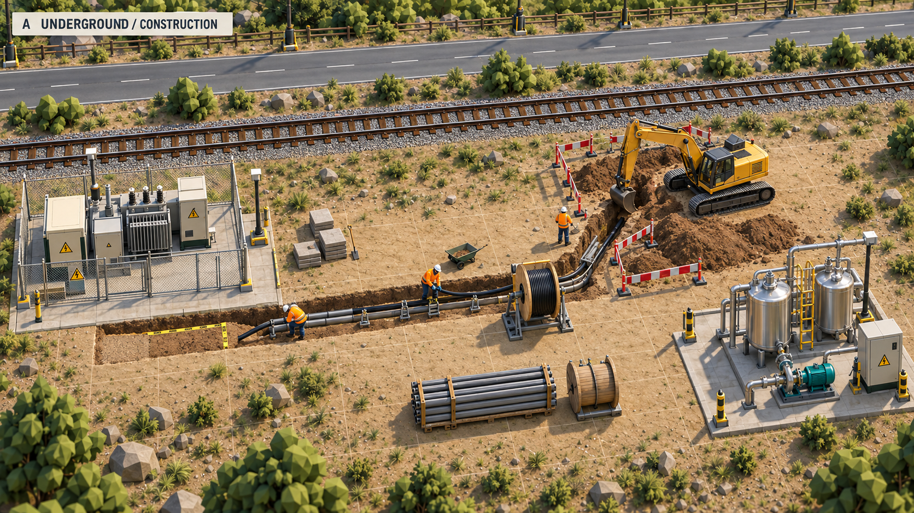
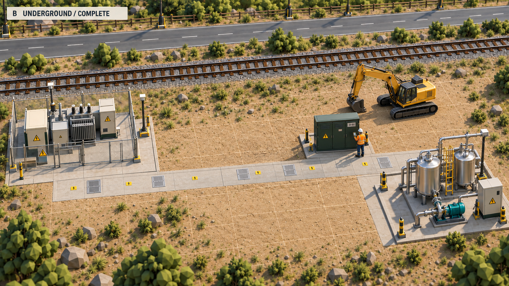
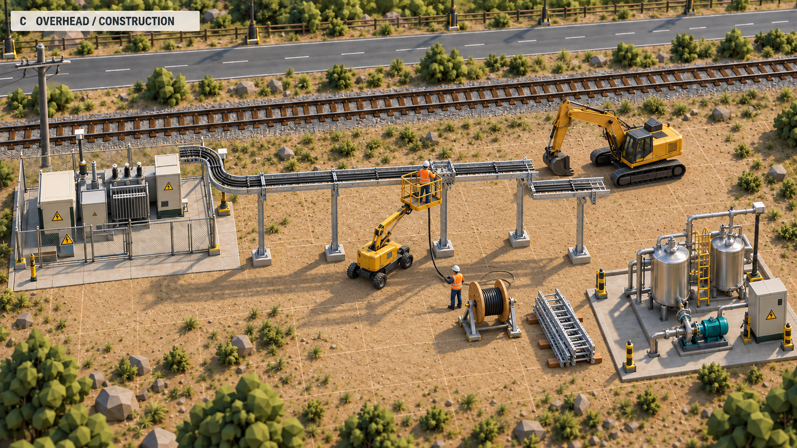
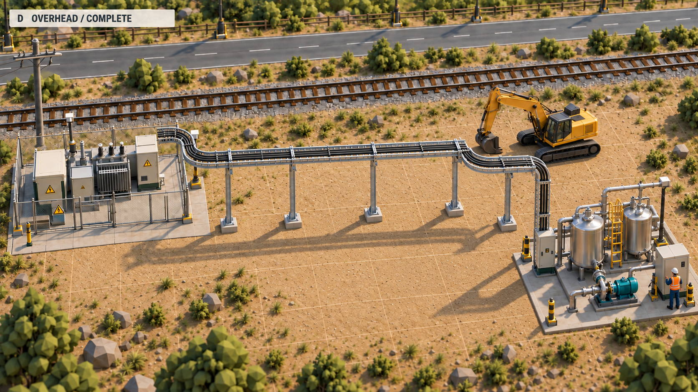

# Electrical distribution concepts — October 7, 2026

These are generated concept images for future electrical construction under [issue #13](https://github.com/lukacslacko/factory_game/issues/13), not screenshots of implemented features. The game and installed app are unchanged. The built-in image generation tool uses the accepted [Concept C native target](../C-native-target.png) as the visual reference. Exact prompts and image hashes are preserved in [generation-prompts.json](generation-prompts.json).

## The creator's request

Compare underground and overhead cabling during construction and after completion. Retain the approved beautiful perspective, detail, bright contrast, reflective metal, varied vegetation and meter-grid organization. The creator favors underground distribution for a growing chemical factory, with substantial power trunks, substations and local distribution rather than wires running arbitrarily across the yard. This is an exploration and discussion request; neither route nor its construction mechanics has been selected for implementation.

## The four panels

| ID | State | What to compare |
| --- | --- | --- |
| A | Underground, construction | Open trench, adjacent excavated spoil, ducts, cable reels and rollers, crew access, excavator and staged backfill. |
| B | Underground, complete | Restored usable ground, flush access covers and discreet route markers, accessible above-ground switchgear and local distribution. |
| C | Overhead, construction | Bolted steel supports, partially assembled ladder trays, stored tray sections, a real work platform and workers pulling cable from a reel. |
| D | Overhead, complete | Supported insulated cable runs, rounded bends and vertical drops, visible frame shadows, above-ground access for inspection. |

The overhead comparison depicts industrial cable trays. A conventional utility pole connection appears only at the boundary. Frames, equipment, cabinets, and restored surfaces retain a comparable layout across the views. Artistic details such as pit frequency, clearances, trench dimensions, cable separation and transformer fittings are illustrative; the images do not specify an engineered installation. Completed underground cables are physically hidden. A future inspection overlay could expose their routes on demand without leaving permanent glowing lines across the yard.

## Proposed direction, awaiting feedback

Favor buried medium-voltage trunks along planned utility corridors, feeding accessible local substations with transformers, protection and distribution equipment. Keep transformers and switchgear above ground in serviceable enclosures for this game's initial design. Use short protected low-voltage connections to equipment and optional orderly cable trays within dense process blocks. Reserve conventional pole lines for the incoming utility supply or remote areas where the player deliberately chooses them.

The distinction between voltage level and installation method matters: a high-power system does not require every cable to be buried. Medium-voltage distribution can feed secondary substations near loads, reducing the length of large low-voltage feeders. Industrial cable ladders/trays are also a credible installation method, including in oil-and-gas applications. This supports a mixed game design rather than a claim that real chemical factories are always entirely underground.

For construction gameplay, A implies a coherent physical sequence: reserve route and spoil/access cells, recover paving where needed, excavate, install bedding/ducts and pull cable, connect and test, backfill and restore the surface, then commission. Ducts and pulling may be separate jobs; their sequence should follow the chosen installation method. C implies foundations and support erection, tray installation, pulling/fixing cables, terminations and testing, then commissioning. Both must consume delivered materials, use real labor/equipment, retain partial progress, and leave physical space for access. The creator's earlier open choice between route-wide and cell-by-cell trench work remains undecided.

## Technical grounding

- [Schneider Electric — Power supply at medium voltage](https://www.electrical-installation.org/enwiki/Power_supply_at_medium_voltage): main and secondary substations, internal MV distribution, and local MV/LV transformers.
- [Schneider Electric — Establishing a new substation](https://www.electrical-installation.org/enwiki/Procedure_for_the_establishment_of_a_new_substation): utility supply may arrive by overhead line or underground cable, followed by testing and commissioning.
- [Eaton — Industrial cable tray and ladder](https://www.eaton.com/us/en-us/catalog/support-systems/imperial-cable-tray-and-ladder.html): supported cable-management systems for industrial and oil-and-gas applications.

These sources inform the plausibility of the concepts. The proposed mix, visual treatment, construction granularity and future game rules remain design choices.

## Creator approval and implemented first scope

The creator subsequently approved A and B and authorized issue #13's implementation. The first native electrical system is deliberately smaller than the long-term medium-voltage concept: one low-power incoming cabinet, 50-meter delivered cable reels, real excavation/spoil/cable/backfill, restored paving, and tested circuits to the existing lights and tanker pumps. Light-base terminal boxes allow branching while retaining the incoming station's shared 16 kW limit. See [Underground electrical service](../../electrical-operations.md). The images above remain concept art; the broader high-power network and overhead alternatives are future design references.
