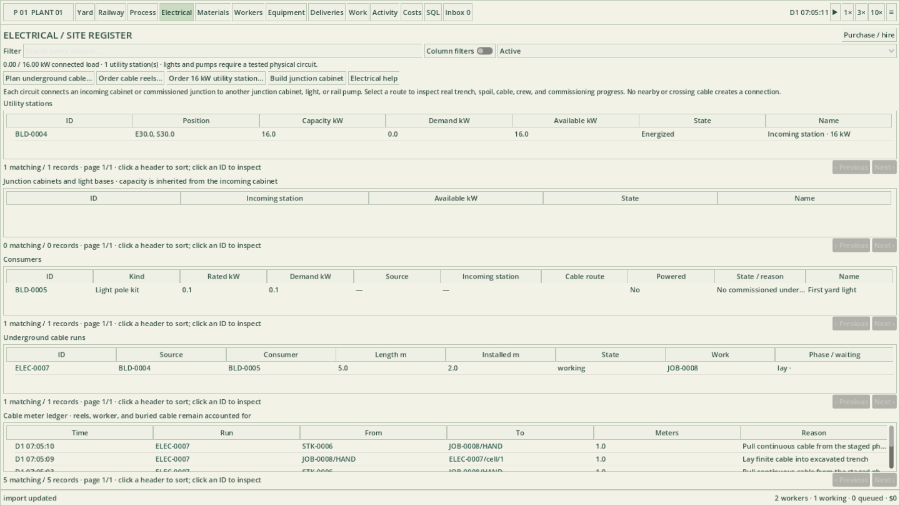

# Underground starter electrical service

Native v0.27.0's Electrical page connects junction cabinets, yard lights, and tanker-transfer pumps to a modest 16 kW incoming station. Every connection is a physical underground circuit. Ordering the utility service alone does not energize the yard. High-voltage distribution, substations, building interiors, and overhead networks remain future work. The v0.24 tutorial booklet predates this feature; this guide and in-game Electrical help describe the new steps.

## Prepare the site

Open **Electrical → Order 16 kW utility station…**. The electrical company arrives by road and installs the incoming cabinet near the receiving access. Keep this area accessible until the visiting crew has finished. The utility service price and its transport charges appear in Costs.

Build the lights or transfer pumps you want to connect using the usual construction tools. For a branch point, purchase an **Electrical junction cabinet kit** and choose **Electrical → Build junction cabinet**. Its 1 × 1 meter foundation and cabinet are built by your normal construction crew and equipment. A cabinet uses no power itself and does not add capacity. Order **Low-voltage cable reel · 50 m** through Purchase / hire. Each delivered reel occupies a physical storage square, starts with 50 meters of cable, and remains as a partially used or empty reel afterward. Keep a driving approach to its storage face.

Hire an **operator** and an **engineer**, and provide a fueled **excavator** with **Construction** enabled under Automatic work. The engineer handles cable and electrical terminations; the operator drives and operates the excavator. Assign an excavator to the cable work manually in Work if you want to reserve a particular machine.

## Draw a circuit

Click **Plan underground cable** in Electrical. Each endpoint supports both methods: type a recognizable name, stable ID, or type in its search field, then select the matching object; or choose **Pick source on map** / **Pick destination on map** and click an outlined electrical object in Yard. You can drag to pan and scroll to zoom while picking. **Escape** or **Back to cable plan** returns to the planner without replacing your previous choice. Picking either end keeps the other selected.

Use **Locate selected** to close the planner and view that asset. Reopen **Cable…** to continue with the same source and destination. In an electrical asset's inspector, **Rename electrical asset…** gives it a label such as “North yard light” or “Tanker bay junction.” IDs, wiring, and historical references remain unchanged. Duplicate names are allowed and remain distinguishable by ID. Existing named railway locations keep their own names and IDs.

Choose **Draw this circuit in Yard** after selecting both objects. Highlighted cells around each asset show its connection boundaries. Click a green source cell and then a blue destination cell to confirm; dragging also works. Press **R** before confirming to change the elbow of the meter-grid route. Press **Escape** to cancel drawing. Read the preview: it reports length and any blocked cell or required spoil space.

Connect the station to a junction cabinet first. Once that run is complete and commissioned, the cabinet becomes a source for additional separately built circuits to lights, pumps, or other cabinets. A commissioned light base also has protected feed-through terminals. All branches ultimately share the original station's 16 kW capacity. A pump is a final consumer. Circuits cannot loop, cross another circuit, share a trench, or cut through track, stored material, or buildings in this starter implementation.

Keep room beside the route. Excavation reserves neighboring space for loose soil, a lifted paving slab when applicable, the staged cable reel, and real machine and walking approaches. A trench is an obstruction while open. Planning an enormous route through a tightly packed stockyard will not create access automatically.

## Watch construction

One linked work order covers the entire connection between two selected assets. The operator boards the excavator and the engineer helps stage a delivered reel. The crew lifts paving where necessary and **excavates the whole run first**. The bucket gathers soil below ground, lifts clear, swings above ground, and tips the soil into its neighboring spoil area before returning.

The engineer then **pulls and seats cable progressively along the open trench** from the staged finite reel. Meter records still track the exact quantity, but the worker does not walk back to the reel for every meter. An exhausted reel is replaced physically. After the cable is laid and both terminals are connected, the crew **backfills the whole run**, restores its paving, and tests it. Power is available only after completion. For a longer distribution layout, use junction cabinets to divide it into practical work sections; one route is limited to 300 meter cells.

Open the run in Electrical or click its ID in Work. Its linked records identify the source, consumer, crew, excavator, reel, current cell, open trench, spoil, and installed meters. A blocked operation produces a warning after 20 simulated seconds. Resolve the named obstruction or provide missing resources; the job keeps its physical progress. The rolling diagnostic export includes electrical phases and the active work cell for later debugging.

Cancellation is a safe stop, not an undo: the crew lowers carried equipment, returns unlaid cable, backfills every open cell, and restores all lifted paving before releasing the assignment. Installed cable remains recorded and the unfinished circuit stays disconnected. Resume the same run to continue. Saving and loading preserves these states and the meter ledger.

## Recover or change a route

Select a run in Electrical and choose **Recover underground cable**. Recover downstream branches before their upstream feed. The engineer isolates the real terminals before excavation; requesting recovery alone does not cut power early. The crew reopens the trench, retrieves its cable into an accessible partially used or empty reel, and backfills and restores the ground. Recovery needs enough free reel capacity and the same crew and excavator as construction. An empty reel is useful stock; do not collect it off site if you intend to recover cable.

Recover the circuits attached to a light or pump before removing the asset. An unfinished canceled circuit can also be recovered. Canceling recovery safely restores every open cell and retains all installed and recovered meters; retry its recovery to finish. Creative placement is instant, but cable recovery still uses this physical crew sequence.

## Use the supplied equipment

A light uses 0.1 kW. A running tanker pump uses 2 kW; a stopped pump does not consume that motor load. Electrical lists the station's demand, remaining capacity, each consumer's connection and power status, and the cable movement ledger. A circuit can be intact while the station is unavailable or its capacity is exhausted.

For a tanker pump, finish its underground circuit as well as its fluid pipe route. Connect the stationary tanker's hose, select the destination tank, open the required valves, and start the pump. The electrical interlock explains an absent circuit, unavailable source, or insufficient capacity. Loss of power stops transfer without deleting fluid; restoring a usable supply lets an enabled pump continue.

Creative mode commissions an explicitly drawn circuit instantly, like other creative construction. It still requires a real source, valid route, and selected consumer; it does not turn on uncabled lights or pumps globally.

SQL reporting includes `electrical_sources`, `electrical_junctions`, `electrical_consumers`, `electrical_runs`, `electrical_cells`, and `cable_movements`. Reels remain in `stacks` with `cableMeters` and `cableReservedMeters`, alongside normal purchasing, handling, and cost history.
