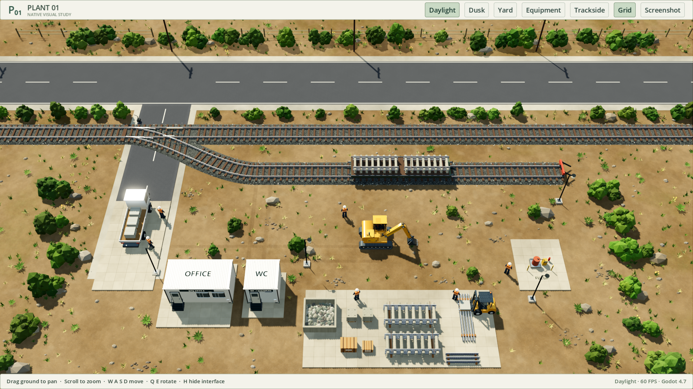
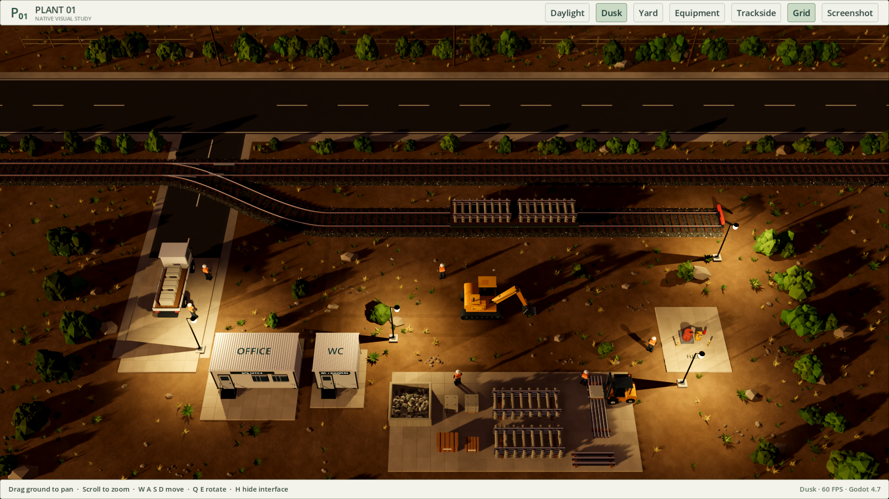

# Plant 01 — native visual proof

An interactive Godot 4.7.2 scene for reviewing the revised concept C aesthetic before migrating the playable factory game. This is a visual study: equipment, workers, and stock are arranged examples, not a connected factory simulation. The web game and its saves are independent.

## Open it on this Mac

Double-click **Open visual proof.command** in Finder. It uses the standard Godot application already installed in `/Applications`, imports the small texture set, and opens the native scene directly. The Terminal window shows startup information. Escape or the window close button quits the preview.

Alternatively, import `project.godot` from Godot's Project Manager, open the project, and press **F6** with `main.tscn` selected, or **F5** to run the project. The constructed scene appears at runtime; the editor scene contains its scripted root.

No browser, Node, .NET, Blender, or export templates are needed for this proof. Standalone application packaging belongs to the migration checkpoint after visual review.

## Controls

| Control | Action |
| --- | --- |
| Left-drag the ground | Pan, anchored to the ground under the cursor |
| W/A/S/D | Move relative to the current view |
| Scroll | Zoom |
| Right-drag | Orbit and adjust elevation |
| Q/E | Rotate |
| Yard / Equipment / Trackside | Smooth camera presets |
| Daylight / Dusk, or 1 / 2 | Switch lighting |
| Grid, or G | Show the 1 m terrain grid |
| H | Hide/show the interface |
| Screenshot, or F12 | Save the native viewport into `captures/` |
| Home | Return to the yard view |
| Escape or the window close button | Quit |

Foreground drawing is capped at 60 FPS; unfocused interactive processing is capped at 15 FPS. The proof contains no simulation to progress while unfocused. Background game progression will be tested with the separate simulation integration.

## Visual contents

True-perspective camera, northwest daylight and warm dusk, soft sun shadows, ambient occlusion, screen-space indirect light, a cloud-and-sun reflection sky, controlled color/exposure, and glowing dusk lamps. Retina rendering, 4× MSAA, temporal antialiasing, mipmaps and 16× anisotropic filtering keep the scene smooth. The preview includes rounded painted machinery panels, reflective cab glass, a seated operator, polished hydraulic rods, hoses, wheels and tread links. Six grounded workers, a truck carrying supported slab pallets, corrugated containers with roof fasteners and gutters, an actual standard-gauge turnout, a four-axle flatcar, physically stacked materials, a bounded rubble bin, and fuel equipment make up the yard.

The machinery is parked parallel to grid axes. Concrete slabs are individually aligned 1 m squares; rail heads leave exactly **1.435 m between their inside faces**. Dense vegetation uses shared instanced meshes with deterministic seeded placement. Soil blends photographic diffuse and normal maps with broad variations, and distant texture detail uses mipmaps.

Code and procedural models are MIT licensed under the repository license. The four external terrain maps are CC0; their authors, verified hashes, and download sources are in [assets/CREDITS.md](assets/CREDITS.md). The supplied [visual target](../docs/design/C-native-target.png) is preserved beside the original concept. The revision was repeatedly compared against actual Godot captures; it remains an engine-rendered interpretation, rather than a claim of pixel-for-pixel reproduction.

## Actual screenshots

These are captured from this Godot project, with no image generation or paint-over:





[Equipment close view](screenshots/equipment.png) · [Trackside view](screenshots/trackside.png) · [Dusk equipment view](screenshots/dusk-equipment.png) · [Daylight without interface](screenshots/daylight-clean.png) · [First pass for comparison](screenshots/daylight-first-pass.png)

## Native verification

From this directory:

```sh
/Applications/Godot.app/Contents/MacOS/Godot --headless --editor --path . --import
/Applications/Godot.app/Contents/MacOS/Godot --headless --path . -- --self-test
/Applications/Godot.app/Contents/MacOS/Godot --headless --path . --script tests/ground_normals.gd
python3 tests/run_native_check.py --timeout 55 --name final-proof -- --rendering-driver vulkan --resolution 1920x1080 -- --capture-suite
```

The capture suite writes six actual Godot screenshots and per-view frame-time/resource reports. It explicitly draws covered windows so it can complete without bringing a browser or the Godot window into focus. The Python watchdog runs one process, limits native resident memory to 2 GB, and terminates it on timeout. Captures, generated caches, and diagnostic logs are excluded from source control. Approved reference screenshots can be copied to `screenshots/` for review.

Vulkan through macOS's Metal translation is the verified project default. Early automated runs that appeared stuck were waiting for drawing of a fully occluded native window. The final capture method explicitly draws instead of waiting for a suppressed `frame_post_draw` signal. Metal is also supported by the installed engine, but this proof defaults to the backend verified end to end.

## Visual revision — October 5, 2026

The creator rejected the first proof for weak brightness and contrast, missing metallic highlights, pixelation and sparse detail. This pass addresses those directly: physical rounded rail crowns and machinery edges; distinct steel, rust, rubber and glass finishes; stronger sun/shade separation; aged concrete and actual lifting recesses; larger layered shrubs, short green/dry tufts and clustered fieldstones; granular tan earth; and a compact yard composition. The 1 m grid stays understated. White roofs and brighter upper faces retain surface detail rather than simply increasing exposure.

Actual renders were compared after each lighting/material pass. An overexposed lime-green intermediate was corrected; so were an overly bright grid, flat ballast, clipped stockyard framing and stippled shadows from subpixel power wires. Low-angle lamp penumbrae showed PCSS bands; fixed higher-quality filtering removed them, and a close dusk view was added to the capture suite. The latter wires retain their visible geometry but do not cast aliased shadow-map dots. Shared instanced vegetation and material-batched railway geometry contain the detail without thousands of extra scene nodes.

## Verified outcome

Godot 4.7.2 / Forward+ / Vulkan on the Apple M2 Pro rendered the final six 1920×1080 captures in 30.16 seconds without engine errors or watchdog intervention. Daylight and dusk yard samples held 60 FPS; equipment, trackside and close dusk samples measured 54–55 FPS. Per-view median frame times ranged from 16.66 to 18.39 ms, with 95th percentiles below 19.34 ms. Sampled peak resident memory was 671.9 MB; Godot reported 635.2 MB in graphics allocations. These are short static-scene measurements, not full-factory benchmarks.

Headless verification checked 118,126 custom and instanced mesh triangles without winding/normal failures, plus all 22 herb triangles.

Final measurements and machine-readable results are recorded in [tests/verified-results.json](tests/verified-results.json). The capture suite uses one bounded native GPU process; rendering at 1920×1080 is measured separately from the logical 1680×945 interface viewport. Foreground and forced offscreen samples are labeled separately. M2 graphics memory is unified: resident memory and Godot graphics allocations are not independent totals to add together.

Headless checks verify custom and instanced mesh winding/normals, standard gauge, lighting, and actual viewport input dispatch for buttons, grid, floor dragging, release over the toolbar and view-relative W movement. Native UI review also checks the launcher and visible result. The watchdog stops automated native runs above 2 GB or their time limit; runs are sequential because of the creator's earlier laptop hang concern.

The scene remains a static visual proof. It does not yet run gameplay, move equipment, import saves or tick a factory simulation in the background. Native migration and file-backed saves remain the next checkpoint under [issue #19](https://github.com/lukacslacko/factory_game/issues/19). The browser game is unchanged.
